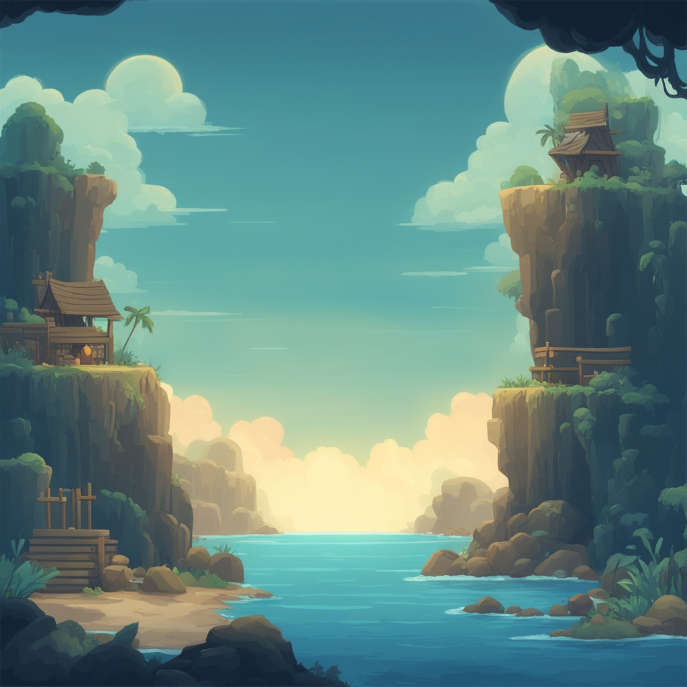

# Sea Survival Game



## Overview

Sea Survival Game is a 2.5D top-down survival game where players navigate through a vast, treacherous ocean, gather resources, craft items, and fend off dangers to stay alive. Developed using Unity, this game blends exploration, crafting, and survival mechanics for a unique experience.

## Features

- **Dynamic Ocean Environment**: A vast ocean to explore, with changing weather and day-night cycles.
- **Resource Management**: Gather materials from the ocean and islands to craft essential tools and structures.
- **Crafting System**: Create new items from gathered resources, including food, tools, and shelters.
- **Survival Mechanics**: Maintain your health, hunger, and thirst levels while surviving against natural elements and wildlife.
- **Progressive Difficulty**: The further you explore, the more challenging the game becomes.

### Prerequisites

Before you begin, ensure you have the following installed on your system:

- [Unity Hub](https://unity.com/download) (for Unity version management)

### Cloning the Repository

To clone the project to your local machine, run:

```bash
git clone https://github.com/TheMC2005/sea-survival-game.git
